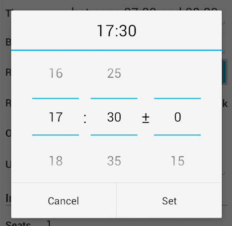
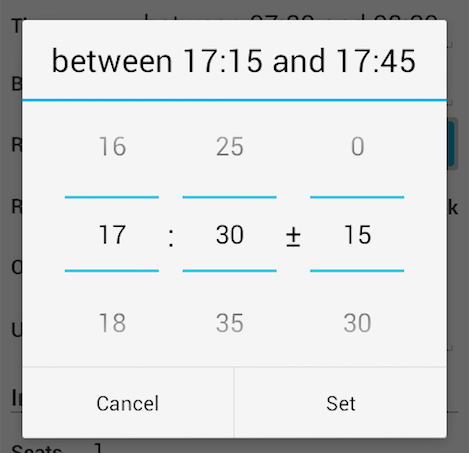

## CustomizableTimeMarginDialog for Android

Android Dialog that lets the user pick a time or a timerange

###Features
 - let users pick a time range, e.g. "between 17:15 and 18:45"
 - extends AlertDialog.Builder

###Customizable
 - minimum time, dialog doesn't let user select a time (hh:mm) before said time
 - custom time steps (e.g. 0, 5, 10, 15, ..., 55 minutes) for hours, minutes or margin minutes

###Example Usage

    CustomizableTimeMarginDialog dialog = 
        new CustomizableTimeMarginDialog(getActivity());
    dialog.create(
         minCalendar, selectedCalendar, selectedMargin,
         onTimeMarginSetListener,
         new CustomizableTimeMarginDialog.NumberPickerValues(0,23,1),
         new CustomizableTimeMarginDialog.NumberPickerValues(0,59,5),
         new CustomizableTimeMarginDialog.NumberPickerValues(0,59,15));
    dialog.show();

### Screenshots
When no margin is chosen:

  

When a margin is chosen:

###To do
- Add support for 12h format

